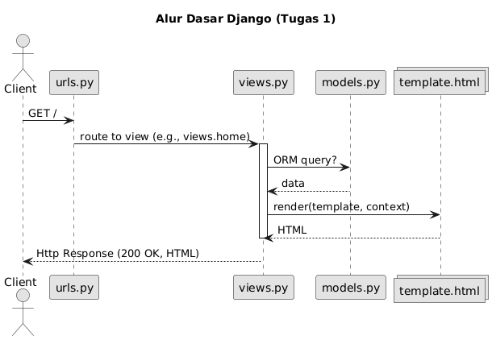
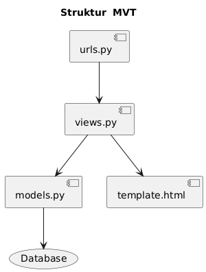
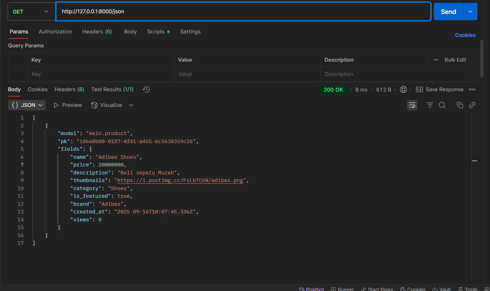
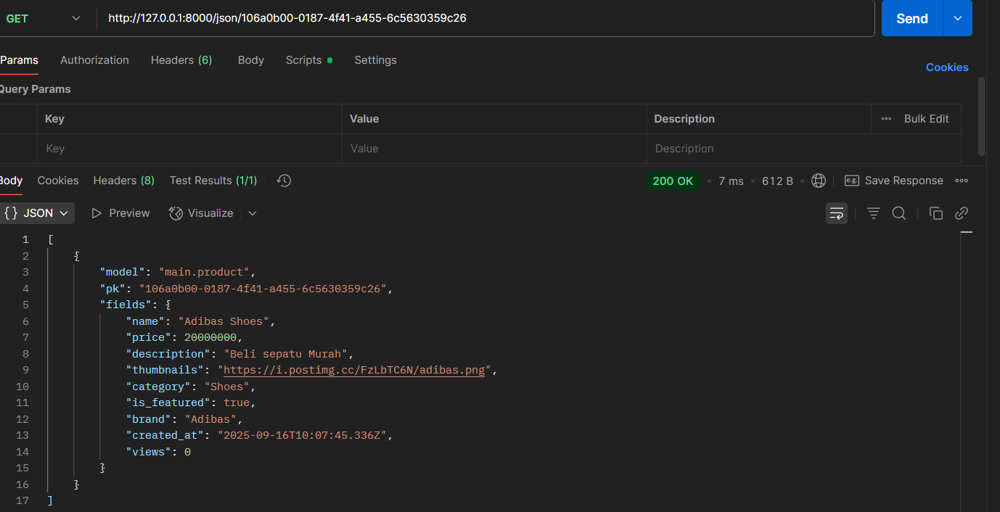
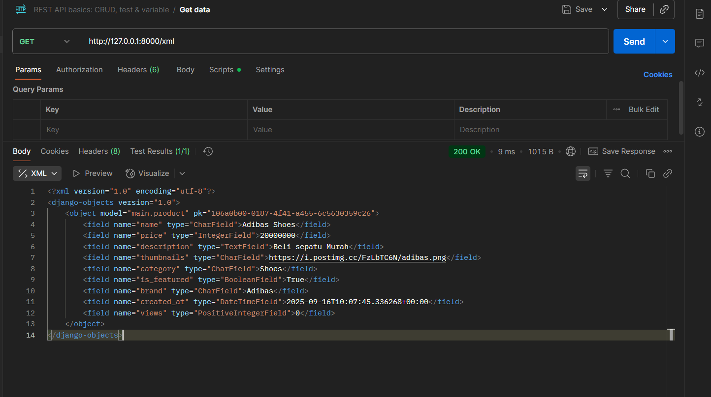
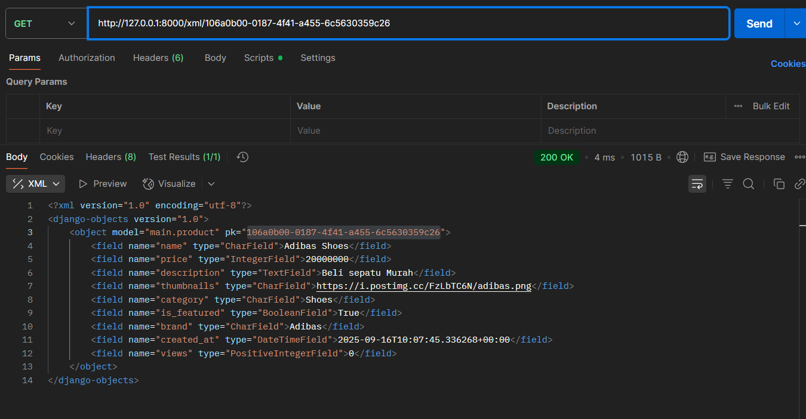

# Football Shop - Toko Sepatu Bola

## `README.md` tugas 3 Dibawah

## Link Aplikasi yang Sudah Di-Deploy
Aplikasi Football Shop saya dapat diakses di: https://pbp.cs.ui.ac.id/gregorius.ega/tokobolaega
Nama Aplikasi: Toko Bola Ega 
Nama: Gregorius Ega Aditama Sudjali
Kelas: PBP C


### 1. Jelaskan bagaimana cara kamu mengimplementasikan checklist di atas secara step-by-step (bukan hanya sekadar mengikuti tutorial).
Saya mengimplementasikan checklist tugas secara bertahap, dengan menyesuaikan tema aplikasi menjadi "Football Shop" yang fokus pada penjualan barang yang terkait dengan bola. Berikut penjelasan step-by-step berdasarkan pengalaman saya, termasuk penyesuaian dan troubleshooting yang saya lakukan:

1. **Membuat proyek Django baru**:  
   Saya membuka terminal di direktori kerja saya dan menjalankan `django-admin startproject football_shop`. Ini membuat struktur proyek dasar dengan file `manage.py`, folder `football_shop` (settings, urls, dll.), dan environment virtual baru menggunakan `python -m venv venv`. Saya mengaktifkan virtual environment dengan  `venv\Scripts\activate`. Kemudian, install Django dan Requirements `pip -r requirements.txt` dan verifikasi dengan `pip list` lalu `django-admin --version`. Saya memastikan versi Django 4.x atau lebih baru untuk kompatibilitas.

2. **Membuat aplikasi dengan nama `main` pada proyek tersebut**:  
   Di dalam direktori proyek, jalankan `python manage.py startapp main`. Ini menghasilkan folder `main` dengan file-file seperti `models.py`, `views.py`, `urls.py`, dan `admin.py`. Saya menambahkan `'main'` ke `INSTALLED_APPS` di `settings.py` untuk mengintegrasikannya ke proyek utama.

3. **Melakukan routing pada proyek agar dapat menjalankan aplikasi `main`**:  
   Di `football_shop/urls.py` (project-level), saya impor `include` dari `django.urls` dan tambahkan path: `path('', include('main.urls'))`. Ini memetakan root URL ke aplikasi `main`. Saya test dengan `python manage.py runserver` dan akses `http://127.0.0.1:8000/` untuk memastikan tidak ada error 404.

4. **Membuat model pada aplikasi `main` dengan nama `Product` dan atribut wajib**:  
   Di `main/models.py`, saya definisikan class `Product(models.Model)` dengan atribut:  
   - `name = models.CharField(max_length=100)` (untuk nama sepatu bola).  
   - `price = models.IntegerField()` (harga dalam Rupiah).  
   - `description = models.TextField()` (deskripsi fitur sepatu).  
   - `thumbnail = models.URLField()` (link gambar sepatu).  
   - `category = models.CharField(max_length=50)` (misal: 'Sepatu Lari', 'Sepatu Futsal').  
   - `is_featured = models.BooleanField(default=False)` (status unggulan).  
   Saya tambahkan atribut opsional seperti `brand = models.CharField(max_length=50)` untuk lebih kreatif. Kemudian, jalankan `python manage.py makemigrations main` dan `python manage.py migrate` untuk membuat tabel di database (default SQLite). 

5. **Membuat fungsi pada `views.py` untuk dikembalikan ke template HTML yang menampilkan nama aplikasi serta nama dan kelas**:  
   Di `main/views.py`, buat fungsi `show_main(request)`:  
   ```python
   from django.shortcuts import render
   def show_main(request):
       context = {
           'app_name': 'Football Shop',
           'nama': '[Nama Mahasiswa]',
           'kelas': '[Kelas Mahasiswa]'
       }
       return render(request, 'main/main.html', ctx)
   ```  
   Ini mengirimkan context ke template tanpa model data dulu, untuk halaman sederhana.

6. **Membuat routing pada `urls.py` aplikasi `main` untuk memetakan fungsi `main` pada `views.py`**:  
   Di `main/urls.py`, impor `path` dan `views`, lalu tambahkan routing berikut:  

   ```python
   from django.urls import path
   from . import views

   urlpatterns = [
       path("", views.main, name="main"),
   ]

7. **Melakukan deployment ke PWS terhadap aplikasi yang sudah dibuat**:  
   Setelah aplikasi selesai dibuat dan diuji di lokal, langkah berikutnya adalah melakukan *deployment* ke **Pacil Web Service (PWS)** agar dapat diakses secara daring. Prosesnya dimulai dengan mengunggah kode proyek ke GitHub, kemudian melakukan *push* ke remote PWS yang sudah dikonfigurasi. Perintah yang digunakan adalah:

   ```bash
   git add .
   git commit -m "done"
   git push origin master
   git push pws master
   ```

### 2. Buatlah bagan yang berisi request client ke web aplikasi berbasis Django beserta responnya dan jelaskan pada bagan tersebut kaitan antara urls.py, views.py, models.py, dan berkas html.
Berikut diagram sederhana :





### Penjelasan Kaitan Komponen (MVT)

- **`urls.py` (level proyek & app)**
  - Pintu masuk request. Memetakan URL dari client ke fungsi view yang tepat.
  - Contoh (project): `path("", include("main.urls"))`
  - Contoh (app): `path("", views.main, name="main")`

- **`views.py`**
  - Jembatan utama MVT: menerima request dari `urls.py`, ambil/olah data (via `models.py` bila perlu), lalu merender template.
  - Contoh: `return render(request, "main/main.html", {"products": Product.objects.all()})`

- **`models.py`**
  - Definisi struktur data & akses database lewat ORM (CRUD).
  - Contoh: 
    ```python
    class Product(models.Model):
        name = models.CharField(max_length=100)
        price = models.IntegerField()
        description = models.TextField()
        thumbnail = models.URLField()
        category = models.CharField(max_length=100)
        is_featured = models.BooleanField(default=False)
        brand = models.CharField(max_length=50, default="Unknown")
    ```

- **Template HTML (`templates/...`)**
  - Tampilan akhir. Menerima **context** dari view dan merender dinamis dengan tag Django.
  - Contoh:
    ```html
    <!doctype html>
      <html>
      <head><meta charset="utf-8"><title>{{ app_name }}</title></head>
      <body>
         <h1>{{ my_app_name|title }}</h1>
         <p>Nama: {{ my_name }}</p>
         <p>Kelas: {{ pbp_class }}</p>
      </body>
      </html>
    ```

**Alur singkat:** `Request → project/urls.py → app/urls.py → views.py → (models.py) → template → Response`  
Ini memastikan pemisahan concern: **route** (urls), **logika** (views), **data** (models), **UI** (templates).


### 3. Jelaskan peran settings.py dalam proyek Django!
`settings.py` adalah file konfigurasi pusat di level proyek Django (di folder `toko_bola_ega/settings.py`). File mengatur seluruh behavior aplikasi, seperti:  
- **Installed Apps**: Daftar aplikasi yang diaktifkan (e.g., `'main'`, `'django.contrib.admin'`). Ini memungkinkan Django load models dan middleware dari app tersebut.  
- **Database Configuration**: Setup koneksi DB (default SQLite, bisa PostgreSQL/MySQL dengan `DATABASES` dict). Termasuk engine, name, user, password.  
- **Middleware**: Daftar prosesor request/response (e.g., authentication, session).  
- **Templates**: Path ke folder templates (e.g., `DIRS = [BASE_DIR / 'main/templates']`) dan backend (DjangoTemplates).  
- **Static/Media Files**: Lokasi CSS/JS/gambar, penting untuk production.  
- **Security**: Secret key, allowed hosts, debug mode (False di production).  
- **Language/Timezone**: Default 'en-us' dan 'UTC', bisa diubah ke 'id' dan 'Asia/Jakarta'.  
Peran utamanya: Menyediakan environment-specific config, memudahkan skalabilitas dan deployment (e.g., bedakan dev vs prod). Jika salah, app bisa crash (e.g., DB error).

### 4. Bagaimana cara kerja migrasi database di Django?
Migrasi (migration) adalah proses sinkronisasi perubahan model (models.py) ke skema database. Django gunakan ORM, jadi tidak perlu SQL manual. Cara kerja step-by-step:  
1. **Buat Migrasi**: Edit models.py (e.g., tambah field). Jalankan `python manage.py makemigrations [toko_bola_ega]` (e.g., `main`). Django deteksi perubahan, buat file migrasi di `app/migrations/` (e.g., `0001_initial.py`) berisi instruksi SQL-like (CreateTable, AddField).  
2. **Apply Migrasi**: Jalankan `python manage.py migrate`. Django eksekusi file migrasi secara berurutan (berdasarkan nomor), update DB skema (tabel, kolom). Untuk initial: Buat tabel dari model.  
3. **Rollback/Check**: Gunakan `migrate [toko_bola_ega] [nomor]` untuk revert (e.g., `migrate main 0001`). `showmigrations` cek status.  
4. **Fake Migrasi**: Jika DB sudah ada skema, `migrate --fake` tandai sebagai applied tanpa eksekusi.  
Proses ini version-controlled, aman untuk tim (commit file migrasi ke Git). Troubleshooting: Konflik jika manual edit DB; solve dengan `migrate --fake-initial`.

### 5. Menurut Anda, dari semua framework yang ada, mengapa framework Django dijadikan permulaan pembelajaran pengembangan perangkat lunak?
Django adalah pilihan ideal untuk pemula karena:  
- **Batteries-Included**: Sudah include banyak fitur out-of-the-box (admin panel, ORM, auth, form handling), jadi fokus belajar logic daripada setup boilerplate. Bandingkan Flask (minimalis, butuh tambah library manual).  
- **MVT Architecture**: Struktur jelas (Model-View-Template) mirip MVC, mudah dipahami untuk transisi ke framework lain seperti Laravel atau Rails. Pemisahan concerns bantu belajar best practices.  
- **ORM dan Abstraksi**: Hindari SQL raw awal, gunakan Pythonic query (e.g., `Model.objects.filter()`), tapi bisa scale ke raw SQL nanti. Bagus untuk pemula tanpa background DB.  
- **Dokumentasi dan Komunitas**: Docs resmi lengkap dengan tutorial interaktif; komunitas besar (Stack Overflow, Django Girls).  
- **Rapid Development**: `startapp`, `makemigrations`, admin auto-generated percepat prototyping. Cocok untuk proyek kecil seperti tugas kuliah.  
- **Secure by Default**: Built-in protection CSRF, XSS, SQL injection; ajar security sejak awal.  
Meski "batteries-included" bisa overwhelming, ia bangun fondasi solid sebelum eksplor framework ringan seperti FastAPI.

### 6. Apakah ada feedback untuk asisten dosen tutorial 1 yang telah kamu kerjakan sebelumnya?
Ya, tutorial 1 sangat membantu untuk memahami MVT dasar, terutama contoh alur request-response. Namun, bisa ditambahkan lebih banyak contoh error handling (e.g., 404 di views) dan integrasi static files lebih awal, karena sering bingung saat deploy. Secara keseluruhan, jelas dan step-by-step, terima kasih Tim Ados dan Tim Dosen :D


# `README.md` tugas 3
### 1. Mengapa kita memerlukan data delivery dalam pengimplementasian sebuah platform?
Data delivery diperlukan untuk memastikan data dapat dikirim dan diterima dengan baik antara server dan klien, mendukung integrasi sistem, dan memastikan komunikasi yang efisien.

#### Manfaat Utama 
- **Reliabilitas & ketahanan** — Antrian jadi buffer untuk menyerap lonjakan dan mencegah timeout/kehilangan pesan; ketersediaan layanan meningkat.  (Microsoft, 2025)
- **Decoupling & integrasi mudah** — Pub/Sub **memisahkan** pengirim dari penerima; tim bisa mengembangkan layanan secara mandiri.  (Google Cloud, 2025)
- **Performa & skalabilitas** — Pola “queue-based load leveling” **meratakan beban** agar layanan hilir tidak kewalahan saat traffic spike.  (Microsoft, 2025)

### 2. Mana yang lebih baik antara XML dan JSON? Mengapa JSON lebih populer dibandingkan XML?
Sebetulnya tergantung pemakaian tidak ada yang `Lebih unggul` tergantung pemakaianya saja.

JSON umumnya lebih baik untuk API modern, aplikasi web/mobile, dan pertukaran data antar-layanan karena sintaksnya ringkas, mudah dibaca/di-parse, dan sudah “bawaan” JavaScript. (Ecma International, 2017)

XML masih unggul untuk data/berkas yang “dokumen-sentris” (e.g. punya mixed content), perlu skema dan validasi ketat (XSD), atau transformasi dokumen (XSLT) (W3C, 2008; W3C, 2017)

### 3. Jelaskan fungsi dari method is_valid() pada form Django dan mengapa kita membutuhkan method tersebut?
Method __validId() digunakan untuk memvalidasi ID yang dimasukkan dalam form agar sesuai dengan aturan tertentu, mencegah input yang tidak valid masuk ke database.

### 4. Mengapa kita membutuhkan csrf_token di form Django, dan apa risikonya jika tidak ada?
Kita membutuhkan `` untuk mencegah **Cross-Site Request Forgery (CSRF)**: ketika pengguna sedang login, browser otomatis menyertakan **cookie sesi** pada permintaan lintas situs; tanpa token acak yang diverifikasi server (melalui `CsrfViewMiddleware`) dan pemeriksaan asal (Origin/Referer serta `CSRF_TRUSTED_ORIGINS`), aplikasi tidak dapat membedakan permintaan sah dari yang dipalsukan. Jika token tidak ada, penyerang dapat menanam **form tersembunyi** atau skrip di situs mereka yang mengirim **POST berbahaya** (mis. ubah email/sandi, tambah admin, transaksi) menggunakan kredensial korban sehingga server keliru menganggapnya valid; atribut cookie **`SameSite`** membantu mengurangi sebagian risiko, namun **bukan pengganti** token—praktik terbaiknya tetap menyertakan `csrf_token` pada setiap form POST dan mengirimnya via header `X-CSRFToken` untuk AJAX. (Django Docs, 2025; MDN Web Docs, 2025; OWASP, n.d.)

### 5. Jelaskan bagaimana cara kamu mengimplementasikan checklist di atas secara step-by-step (bukan hanya sekadar mengikuti tutorial).

**a.** Buat **halaman form** agar pengguna bisa menambahkan objek baru dengan field yang diperlukan.  
**b.** Tambahkan **dua view** terpisah: satu untuk **membuat objek** (GET/POST) dan satu untuk **menampilkan detail** objek; sediakan **dua template HTML** masing-masing untuk form dan detail.  
**c.** Perbarui `main.html` untuk menampilkan **daftar objek** dan **tombol aksi**, lalu tautkan tiap tombol/tautan ke view terkait menggunakan **reverse URL** (``).  
**d.** Implementasikan **data delivery**: buat view yang mengembalikan **XML** dan **JSON** untuk **seluruh data** maupun **berdasarkan ID**, lalu daftarkan **routing**-nya di `urls.py`.  
**e.** Lakukan **uji manual**: jalankan server lokal (`python manage.py runserver`) dan akses endpoint di **localhost** untuk memastikan semuanya berfungsi.  
**f.** **Terakhir**, lakukan **deploy ke PWS**, pastikan konfigurasi (mis. `ALLOWED_HOSTS`, `CSRF_TRUSTED_ORIGINS`) sudah benar.

## Postman Screen Shoot





###  Apakah ada feedback untuk asdos di tutorial 2 yang sudah kalian kerjakan?
saya ingin tutorial lebih inetraktif/diberi materi sebelum mengerjakan tutorial

## sources
Microsoft. (n.d.). Queue-based load leveling pattern (Azure Architecture Center). https://learn.microsoft.com/en-us/azure/architecture/patterns/queue-based-load-leveling. (Diakses 16 September 2025).

Google Cloud. (n.d.). What is Pub/Sub? (Overview). https://cloud.google.com/pubsub/docs/overview. (Diakses 16 September 2025).

W3C. (2008). Extensible Markup Language (XML) 1.0 (Fifth Edition)

Ecma International. (2017). ECMA-404: The JSON Data Interchange Syntax (2nd ed.)

W3C. (2017). XSL Transformations (XSLT) Version 3.0.
Django Software Foundation. (n.d.). *Cross site request forgery (CSRF) protection*. https://docs.djangoproject.com/en/5.2/ref/csrf/ (Diakses 16 September 2025)

Django Software Foundation. (n.d.). *How to use Django’s CSRF protection*. https://docs.djangoproject.com/en/5.2/howto/csrf/ (Diakses 16 September 2025)

Django Software Foundation. (n.d.). *Settings: CSRF_TRUSTED_ORIGINS*. https://docs.djangoproject.com/en/5.2/ref/settings/ (Diakses 16 September 2025)

Mozilla. (2025, September 1). *Using HTTP cookies*. MDN Web Docs. https://developer.mozilla.org/en-US/docs/Web/HTTP/Guides/Cookies

Mozilla. (2025, June 7). *Cross-site request forgery (CSRF)*. MDN Web Docs. https://developer.mozilla.org/en-US/docs/Web/Security/Attacks/CSRF

OWASP Foundation. (n.d.). *Cross-Site Request Forgery (CSRF) Prevention Cheat Sheet*. OWASP Cheat Sheet Series. https://cheatsheetseries.owasp.org/cheatsheets/Cross-Site_Request_Forgery_Prevention_Cheat_Sheet.html

OWASP Foundation. (n.d.). *SameSite*. https://owasp.org/www-community/SameSite


# Readme Tugas 4

## TUGAS 4 — AUTENTIKASI, SESSION, COOKIES (toko-bola-ega)

### 1. APA ITU DJANGO AuthenticationForm?

`AuthenticationForm` (django.contrib.auth.forms.AuthenticationForm) adalah form bawaan untuk LOGIN: menyediakan field `username` dan `password`, memvalidasi kredensial via auth backend, lalu kita panggil `login(request, user)` untuk membuat sesi (Django Software Foundation, n.d.-a). ([Django Project][1])
  KELEBIHAN:
* Siap pakai, validasi standar, terintegrasi dengan `authenticate()`/`login()` dan session (Django Software Foundation, n.d.-a). ([Django Project][1])
* Password hashing dan mekanisme auth ditangani core Django, bukan form.
  KEKURANGAN:
* Default hanya `username`+`password`; login via email/identifier lain perlu subclass/override (Django Software Foundation, n.d.-b). ([Django Project][2])
* Tidak menyertakan remember-me / 2FA—harus ditambah sendiri.

2. AUTENTIKASI VS OTORISASI (dan bagaimana Django melakukannya)

Autentikasi = verifikasi identitas “siapa kamu”. Otorisasi = izin “kamu boleh apa”. Django memisahkan konsep ini di sistem auth/permissions; `AuthenticationMiddleware` mengisi `request.user`, `login()` membuat session; pembatasan akses via `@login_required`/permissions (Django Software Foundation, n.d.-c; Microsoft, 2025a). ([Django Project][3])
Di toko-bola-ega:

  * `login_user` memakai `AuthenticationForm`; jika valid → `login()` lalu set cookie demo `last_login`.
  * `logout_user` memanggil `logout()` dan menghapus cookie `last_login`.
  * View penting (`show_main`, `create_product`) dibungkus `@login_required` (Django Software Foundation, n.d.-c). ([Django Project][3])

### 3. SESSION vs COOKIES untuk menyimpan state
   SESSION (server-side)

Plus: data sensitif tidak di klien; bisa di-invalidate server; cocok untuk info autentikasi/otorisasi. Django menyimpan data di server, klien hanya membawa session ID (Django Software Foundation, n.d.-d). ([Django Project][4])
Minus: butuh storage (DB/Redis/file); scaling perlu shared store; tetap perlu mitigasi (rotasi session saat login, dsb).
  COOKIES (client-side)
Plus: sederhana, tanpa storage server; cocok untuk preferensi ringan (mis. `last_login` demo).
Minus: ukuran kecil, dapat dibaca/manipulasi klien; perlu flag keamanan (`Secure`, `HttpOnly`, `SameSite`) dan HTTPS (Mozilla, 2025a; 2025b). ([MDN Web Docs][5])

### 4. APAKAH COOKIES “AMAN DEFAULT”? RISIKO & CARA DJANGO MENGATASI

* Cookies tidak otomatis aman. Risiko: XSS (jika tidak `HttpOnly`), sniffing (jika tidak `Secure`/tanpa HTTPS), dan CSRF (browser mengirim cookie otomatis) (Mozilla, 2025a; OWASP Foundation, n.d.-a). ([MDN Web Docs][6])
Mitigasi (production):
  `SESSION_COOKIE_HTTPONLY=True`, `SESSION_COOKIE_SECURE=True`, `CSRF_COOKIE_SECURE=True`, `SESSION_COOKIE_SAMESITE='Lax'` + HTTPS (Mozilla, 2025a; OWASP Foundation, n.d.-b). ([MDN Web Docs][6])
  Gunakan CSRF middleware dan ``; Django’s CSRF mengeluarkan token & cookie rahasia; nilai secret diganti saat user login (Django Software Foundation, n.d.-e; n.d.-f). ([Django Project][7]) Prinsip: taruh hal sensitif di session server-side; gunakan cookies hanya untuk data non-sensitif.

5. STEP-BY-STEP YANG SAYA LAKUKAN DI “TOKO-BOLA-EGA” (BUKAN SEKADAR IKUT TUTORIAL)
   A. Persiapan database
   `python manage.py makemigrations && python manage.py migrate`
  B. REGISTER, LOGIN, LOGOUT
  Register: `UserCreationForm`; POST valid → buat user → redirect login.
   Login: `AuthenticationForm` → POST valid:
  1. `user = form.get_user()`
  2. `login(request, user)` (membuat session)
  3. set cookie demo `last_login`
  4. redirect ke katalog
     (Django Software Foundation, n.d.-c; Microsoft, 2025b). ([Django Project][3])
     Logout: `logout(request)` lalu hapus cookie `last_login`.
  C. Proteksi halaman dengan `@login_required`
  Tambahkan pada `show_main`, `create_product`, dll. (Django Software Foundation, n.d.-c). ([Django Project][3])
  D. Menghubungkan Product ↔ User (owner)
   Model: `user = models.ForeignKey(User, on_delete=models.CASCADE, null=True)` → makemigrations + migrate.
   View `create_product`:

  ```
  form = ProductForm(request.POST or None)
  if form.is_valid() and request.method == "POST":
      product = form.save(commit=False)
      product.user = request.user
      product.save()
      return redirect("main:show_main")
  ```
  Catatan: produk lama (user=NULL) tak muncul di “My Products”; backfill via shell atau buat ulang.
  E. Filter “All Products” vs “My Products”
  `show_main`:

  ```
  filter_type = request.GET.get("filter", "all")
  products = (Product.objects.filter(user=request.user)
              if filter_type == "my" else Product.objects.all())
  ```
  `main.html`:

  ```
  <a href="?filter=all"><button type="button">All Products</button></a>
  <a href="?filter=my"><button type="button">My Products</button></a>
  ```

F. Menampilkan identitas user + last\_login

* Context `student = { npm, name/username, kelas, last_login }`
* Template:

  ```
  
  <h5>Sesi terakhir login: {{ student.last_login }}</h5>
  ```

G. Keamanan cookies (opsi production)

* Di `settings.py` (saat deploy):

  ```
  SESSION_COOKIE_SECURE = True
  CSRF_COOKIE_SECURE = True
  SESSION_COOKIE_HTTPONLY = True
  SESSION_COOKIE_SAMESITE = 'Lax'
  ```
  Jalankan site via HTTPS; gunakan `` di semua form POST (Django Software Foundation, n.d.-f; Mozilla, 2025a). ([Django Project][8])
  H. Uji fungsional
  Buat 2 akun; masing-masing buat 2–3 Product.
  “All” menampilkan semua; “My” menampilkan milik akun aktif saja.
  Header (NPM/Name/Username/Class) dan “Sesi terakhir login” tampil sekali di atas daftar.

6. RANGKUMAN JAWABAN (SINGKAT)
`AuthenticationForm`: form login bawaan; pro—cepat, terintegrasi; kontra—fitur lanjut perlu kustom (Django Software Foundation, n.d.-a, n.d.-b). ([Django Project][1])
Autentikasi ≠ Otorisasi; Django: authenticate/login + session untuk autentikasi; permissions/@login\_required untuk otorisasi (Django Software Foundation, n.d.-c; Microsoft, 2025a). ([Django Project][3])
Session vs Cookies: session = server-side; cookies = client-side (Django Software Foundation, n.d.-d; Mozilla, 2025a). ([Django Project][4])
Cookies tidak otomatis aman; gunakan `Secure`/`HttpOnly`/`SameSite`, HTTPS, dan CSRF middleware/`` (Mozilla, 2025a; Django Software Foundation, n.d.-f; OWASP Foundation, n.d.-a). ([MDN Web Docs][6])

## REFERENCES

```
Django Software Foundation. (n.d.-a). Using the Django authentication system. In Django documentation (v5.2). Retrieved September 23, 2025, from https://docs.djangoproject.com/en/5.2/topics/auth/default/

Django Software Foundation. (n.d.-b). Customizing authentication in Django. In Django documentation (v5.2). Retrieved September 23, 2025, from https://docs.djangoproject.com/en/5.2/topics/auth/customizing/

Django Software Foundation. (n.d.-c). User authentication in Django (overview). In Django documentation (v5.2). Retrieved September 23, 2025, from https://docs.djangoproject.com/en/5.2/topics/auth/

Django Software Foundation. (n.d.-d). How to use sessions. In Django documentation (v5.2). Retrieved September 23, 2025, from https://docs.djangoproject.com/en/5.2/topics/http/sessions/

Django Software Foundation. (n.d.-e). Cross Site Request Forgery protection (reference). In Django documentation (v5.2). Retrieved September 23, 2025, from https://docs.djangoproject.com/en/5.2/ref/csrf/

Django Software Foundation. (n.d.-f). How to use Django’s CSRF protection (how-to). In Django documentation (v5.2). Retrieved September 23, 2025, from https://docs.djangoproject.com/en/5.2/howto/csrf/

Microsoft. (2025a, March 21). Authentication vs. authorization — Microsoft identity platform. Microsoft Learn. https://learn.microsoft.com/en-us/entra/identity-platform/authentication-vs-authorization

Microsoft. (2025b, March 28). Authentication and authorization in Azure App Service. Microsoft Learn. https://learn.microsoft.com/en-us/azure/app-service/overview-authentication-authorization

Mozilla. (2025a, September 1). Using HTTP cookies (guide). MDN Web Docs. https://developer.mozilla.org/en-US/docs/Web/HTTP/Guides/Cookies

Mozilla. (2025b, September 1). Set-Cookie header (reference). MDN Web Docs. https://developer.mozilla.org/en-US/docs/Web/HTTP/Reference/Headers/Set-Cookie

OWASP Foundation. (n.d.-a). Session Management Cheat Sheet. OWASP Cheat Sheet Series. Retrieved September 23, 2025, from https://cheatsheetseries.owasp.org/cheatsheets/Session_Management_Cheat_Sheet.html

OWASP Foundation. (n.d.-b). Cookie Theft Mitigation Cheat Sheet. OWASP Cheat Sheet Series. Retrieved September 23, 2025, from https://cheatsheetseries.owasp.org/cheatsheets/Cookie_Theft_Mitigation_Cheat_Sheet.html
```

[1]: https://docs.djangoproject.com/en/5.2/topics/auth/default/ "Using the Django authentication system"
[2]: https://docs.djangoproject.com/en/5.2/topics/auth/customizing/ "Customizing authentication in Django"
[3]: https://docs.djangoproject.com/en/5.2/topics/auth/ "User authentication in Django"
[4]: https://docs.djangoproject.com/en/5.2/topics/http/sessions/ "How to use sessions"
[5]: https://developer.mozilla.org/en-US/docs/Web/HTTP/Reference/Headers/ "Set-Cookie header - HTTP - MDN - Mozilla"
[6]: https://developer.mozilla.org/en-US/docs/Web/HTTP/Guides/"Using HTTP cookies - MDN - Mozilla"
[7]: https://docs.djangoproject.com/en/5.2/ref/csrf/ "Cross Site Request Forgery protection"
[8]: https://docs.djangoproject.com/en/5.2/howto/csrf/ "How to use Django's CSRF protection"


# Tugas 4

### 1. Urutan prioritas (specificity) CSS selector

Urutan prioritas dari **paling kuat → paling lemah**:

1. `!important` 
2. **Inline style** pada elemen, mis. `<div style="...">`.
3. **ID selector**: `#id`.
4. **Class / attribute / pseudo-class**: `.btn`, `[type="text"]`, `:hover`, `:focus`.
5. **Type / pseudo-element**: `div`, `h1`, `::before`, `::marker`.
6. **Universal**: `*`.

Jika spesifisitas sama, **aturan yang ditulis paling akhir** (paling bawah / dimuat terakhir) yang berlaku (*source order*).
Tips:

* Tingkatkan spesifisitas dengan **class** ketimbang memakai `!important`.
* Konsisten dengan utilitas (mis. Tailwind) atau metodologi seperti **BEM** supaya tidak terjadi “perang” spesifisitas.

---

### 2. Mengapa responsive design penting? (dengan contoh)

Pengguna mengakses web dari berbagai ukuran layar (HP, tablet, laptop, monitor ultrawide). Tanpa layout responsif:

* konten dapat meluber/terpotong,
* teks & tombol susah dibaca/di-tap,
* UX buruk → bounce rate naik.

**Contoh sudah responsif**
Marketplace/blog modern: layout menyesuaikan lebar, gambar adaptif, navigasi berubah jadi **hamburger** di mobile, grid menjadi 1 kolom di HP dan 3 kolom di desktop.

**Contoh belum responsif (gambaran umum)**
Dashboard generasi lama yang “mengunci” lebar 1024px—di HP harus **zoom & geser horizontal**; tabel melebihi layar, navbar tidak beradaptasi.

**Cara menerapkan singkat**

* Gunakan unit fleksibel (`%`, `vw`, `minmax()`, `flex`, `grid`),
* Media query / utilitas responsif (Tailwind: `sm:`, `md:`, `lg:`),
* Gambar responsif (`max-width: 100%`, `object-cover`).

---

### 3. Perbedaan **margin**, **border**, dan **padding** + implementasi

* **Margin**: ruang **di luar** border → jarak antar elemen.
* **Border**: garis **pembatas** elemen.
* **Padding**: ruang **di dalam** border → jarak konten ke border.

Contoh:

```css
.card {
  /* jarak kartu dengan elemen lain */
  margin: 16px;

  /* garis pinggir kartu */
  border: 1px solid #e5e7eb;

  /* ruang di dalam kartu agar konten tidak mepet border */
  padding: 12px;

  border-radius: 12px;
  box-sizing: border-box; /* ukuran lebih mudah diprediksi */
}
```

Catatan: *margin collapsing* bisa terjadi pada margin vertikal antar blok.

---

### 4. Konsep **Flexbox** & **Grid Layout** + kegunaannya

**Flexbox (1 dimensi)** — mengatur **baris ATAU kolom**

* Properti utama: `display:flex`, `flex-direction`, `justify-content`, `align-items`, `gap`, `flex-wrap`, `flex:1`.
* Cocok untuk: navbar, baris tombol, center vertikal/horizontal, list yang mengalir.

Contoh:

```css
.nav { display:flex; justify-content:space-between; align-items:center; gap:12px; }
```

**CSS Grid (2 dimensi)** — mengatur **baris DAN kolom**

* Properti utama: `display:grid`, `grid-template-columns/rows`, `gap`, `grid-area`, `place-items`.
* Cocok untuk: layout halaman, galeri, dashboard, kartu produk multi-kolom.

Contoh:

```css
.grid {
  display: grid;
  grid-template-columns: repeat(auto-fit, minmax(220px, 1fr));
  gap: 16px;
}
```

**Kapan pakai yang mana?**
Flex untuk deretan satu arah + alignment; Grid untuk komposisi 2D (baris & kolom) yang lebih kompleks.

---

### 5. Step-by-step implementasi di proyek ini (MEM)

Ringkasan konkret yang saya kerjakan bareng kamu:

1. **Login jadi card rapi**
   Mengubah hero + form terpisah menjadi **satu card** dengan header “Welcome back” dan gaya ungu; fokus pada form & aksesibilitas.

2. **Aksen ungu konsisten**
   Mengganti kelas ke `bg-violet-600`/`hover:bg-violet-700` untuk tombol & pill. State aktif “All/My Product” diberi **solid violet**, nonaktif outline ungu.

3. **Filter “All / My Product” accessible**
   Menghindari ekspresi logika dalam `{{ }}`; pakai boolean dari view (`is_all_active`, `is_my_active`) untuk `aria-pressed` dan kelas aktif.

4. **Navbar kategori** (Jerseys, Balls, Trainers, Protectors, Clearance, Misc / Others)

   * Menetapkan `CATEGORY_CHOICES` di **module-level** `models.py`.
   * Menampilkan **pills** kategori di navbar dan **memusatkannya** memakai grid 3 kolom (`1fr auto 1fr`) → brand kiri, kategori **tengah**, aksi kanan.

5. **“Add Product” CTA**

   * Menambahkan tombol **Add Product** di navbar (desktop & mobile).
   * Menambah **kartu “+ List product for sale”** sebagai tile pertama di grid ketika user login (shortcut ke halaman create).

6. **Dropdown Product Type yang benar**

   * Field `category` memakai `choices=CATEGORY_CHOICES` → `<select>` otomatis di form.
   * Menyimpan **kode** kategori (mis. `jerseys`) di DB; menampilkan label dengan `{{ obj.get_category_display }}`.
   * Khusus `misc`: menampilkan input teks opsional (custom note). *Opsional*: prepend note ke `description` agar mudah dicari.

7. **Filtering kategori yang robust**

   * Filter berdasarkan **kode** (`category=code`).
   * **Backward-compatible** untuk data lama yang mungkin menyimpan **label** dengan `Q(category__iexact=label)`.
   * Untuk `misc`, mengikutkan kategori lama yang tak terdaftar.

8. **Styling form tanpa `add_class` error**

   * Menghindari error `Invalid filter: 'add_class'` dengan memindahkan kelas Tailwind ke **widgets** di `forms.py` (atau alternatif: pakai `django-widget-tweaks` + ``).

9. **Perbaikan `NameError: CATEGORY_CHOICES`**

   * Memastikan konstanta didefinisikan **sebelum** dipakai (module-level), memperbaiki method `categories()` agar mengembalikan nilai yang benar.

10. **PowerShell & manage.py**

    * Menjalankan migrasi tanpa `&&` (pakai `;` atau jalankan satu-satu).
    * (Opsional) `manage.py` yang memuat `.env` dan memberi warning jika tidak dalam virtualenv.


# Tugas 6


## 1 Perbedaan **synchronous request** dan **asynchronous request**

Permintaan **synchronous** adalah pola klasik web: ketika pengguna mengirim form atau mengeklik tautan, browser mengirim request lalu **menunggu** respons untuk **merender ulang** seluruh halaman. Ini sederhana karena alur kontrolnya sepenuhnya di server (Django menyiapkan HTML utuh), tetapi dari sisi pengguna terasa “berat”: halaman “berkedip”, posisi scroll hilang, dan untuk perubahan kecil tetap memindahkan banyak data. Sebaliknya, permintaan **asynchronous** (AJAX) mengirim request lewat JavaScript **di latar belakang** tanpa mengganti halaman. Kamu tinggal memperbarui bagian DOM yang berubah, menampilkan *loading/error/empty state*, atau memunculkan *toast* — hasilnya UX jauh lebih mulus dan responsif. Contoh paling jelas ada di halaman katalog kamu: grid produk di-*render* ulang **tanpa reload** hanya dengan memanggil API JSON, bukan mengunduh halaman HTML baru.

```js
// (main.html) — asinkron: muat grid produk tanpa reload halaman
async function loadProducts() {
  gridAJAX.innerHTML = `<div class="col-span-full text-center text-gray-600">Loading…</div>`;
  const mine = (getParam('filter') === 'my') ? '&mine=1' : '';
  const q    = getParam('q') ? `&q=${encodeURIComponent(getParam('q'))}` : '';
  try {
    const res  = await fetch(`/api/products/?${mine}${q}`, {
      headers: { "Accept":"application/json" },
      credentials: 'same-origin'
    });
    const data = await res.json();
    gridAJAX.innerHTML = data.items.length
      ? data.items.map(cardHTML).join('')
      : `<div class="col-span-full text-center text-gray-600">No products yet.</div>`;
  } catch {
    gridAJAX.innerHTML = `<div class="col-span-full text-center text-red-600">Failed to load.</div>`;
  }
}
```


## 2 Bagaimana **AJAX** bekerja di Django (alur request–response)?

Pada level konsep, **aksi pengguna** (misalnya klik “Create”, “Edit”, “Delete”, atau “Login”) memicu JavaScript di browser. JavaScript lalu memanggil **endpoint Django** (biasanya diawali `/api/...`) menggunakan `fetch()` dengan **header** yang benar (terutama `Content-Type: application/json` dan **`X-CSRFToken`**), serta **`credentials: 'same-origin'`** supaya cookie sesi terkirim. **URLconf** memetakan alamat ke **view** Django yang memproses logika (validasi form, cek kepemilikan, CRUD database, autentikasi). Alih-alih mengembalikan HTML, view akan membalas **JSON** (`JsonResponse`) berisi `ok: true/false`, `items`, atau `errors`. Begitu JSON diterima, JavaScript **mengubah DOM**: menutup modal, menyusun ulang kartu produk, menampilkan *toast*, atau mengarahkan pengguna. Dengan cara ini, **siklusnya pendek** dan halaman tidak pernah di-reload penuh.

Kamu sudah menerapkan pola ini untuk **Create/Edit/Delete** produk melalui modal:

```js
// (main.html) — CREATE
createForm.addEventListener('submit', async (e) => {
  e.preventDefault();
  const fd = new FormData(createForm);
  const payload = Object.fromEntries(fd.entries());
  payload.is_featured = payload.is_featured === 'true';
  try {
    const res = await fetch("", {
      method:'POST',
      credentials: 'same-origin',
      headers: Object.assign({'Content-Type':'application/json'}, withCsrf()),
      body: JSON.stringify(payload)
    });
    const data = await res.json();
    if (data.ok) { closeCreate(); toast('Product created', 'success'); reloadProducts?.(); }
    else { toast('Create failed', 'error'); }
  } catch { toast('Network error', 'error'); }
});

// (main.html) — EDIT (PATCH sebagian kolom)
editForm.addEventListener('submit', async (e) => {
  e.preventDefault();
  const fd = new FormData(editForm);
  const payload = Object.fromEntries(fd.entries());
  if (payload.price) payload.price = Number(payload.price);
  payload.is_featured = payload.is_featured === 'true';
  try {
    const res = await fetch(`/api/products/${editingId}/`, {
      method:'PATCH',
      credentials: 'same-origin',
      headers: Object.assign({'Content-Type':'application/json'}, withCsrf()),
      body: JSON.stringify(payload)
    });
    const data = await res.json();
    if (data.ok) { closeEdit(); toast('Product updated', 'success'); reloadProducts?.(); }
    else { toast('Update failed', 'error'); }
  } catch { toast('Network error', 'error'); }
});

// (main.html) — DELETE
confirmDelete.addEventListener('click', async () => {
  try {
    const res = await fetch(`/api/products/${deletingId}/`, {
      method:'DELETE',
      credentials: 'same-origin',
      headers: withCsrf()
    });
    const data = await res.json();
    if (data.ok) { closeConfirm(); toast('Product deleted', 'success'); reloadProducts?.(); }
    else { toast('Delete failed', 'error'); }
  } catch { toast('Network error', 'error'); }
});
```

Perhatikan tiga hal yang sudah benar di implementasimu: (1) `credentials: 'same-origin'` supaya cookie sesi terkirim, (2) **CSRF** di header via helper `withCsrf()`, dan (3) respon server diparsing sebagai JSON lalu dipakai untuk update UI.

---

## 3 Keuntungan menggunakan **AJAX** dibanding render biasa di Django

Keuntungan utama AJAX di proyekmu adalah **performa UX** dan **kontrol antarmuka**. Karena tidak ada *full reload*, pengguna tidak kehilangan konteks (scroll, input yang sudah diisi, state terbuka), dan hanya bagian yang berubah yang di-*render* ulang. Ini tampak jelas saat kamu memanfaatkan **modal Create/Edit/Delete**: form mengirim data via `fetch`, lalu pada sukses kamu memanggil `reloadProducts?.()` untuk **memperbarui grid**; semuanya terjadi tanpa berpindah halaman. Di saat yang sama, kamu bebas menampilkan *loading*, *empty state*, dan *error state* di tempat yang tepat (lihat `loadProducts()` mengisi “Loading…”, fallback error “Failed to load.”, atau “No products yet.”); hal ini **mustahil** dilakukan sepresisi itu jika setiap aksi memicu *full reload*. Selain itu, pola “Django kirim **data** (JSON), front-end yang memutuskan **bagaimana** menampilkan” membuat endpoint API-mu **reusable** dan mudah dipakai ulang di halaman lain.

---

## 4 Cara memastikan **keamanan** saat menggunakan AJAX untuk Login & Register di Django

Kuncinya: **CSRF, cookie sesi, metode benar, dan HTTPS**. Di **klien**, kamu sudah mengirim **`credentials: 'same-origin'`** agar cookie sesi ikut, lalu menyertakan **`X-CSRFToken`** (helper `withCsrf()` di `base.html`). Di **server**, pastikan `CsrfViewMiddleware` aktif (default), view login/register hanya menerima **POST** (`@require_http_methods(["POST"])`), autentikasi pakai **`authenticate()`** lalu **`login()`**, dan seluruh transmisi lewat **HTTPS** agar kredensial terenkripsi. Pesan kesalahan sebaiknya **umum** (“username atau password salah”), bukan indikasi detail yang memudahkan enumerasi akun. Jika aplikasi dipublikasikan, pertimbangkan **rate limiting / lockout** untuk menahan brute-force. Implementasi login AJAX-mu sendiri sudah rapi: kamu menambahkan `Accept: 'application/json'`, `Content-Type: 'application/json'`, *handle* `403 CSRF`, dan **tidak** menyimpan password di sisi klien.

```html
<!-- (base.html) — helper global -->
<script>
(function(){
  function getCookie(name){
    const v = document.cookie.match('(^|;)\\s*' + name + '\\s*=\\s*([^;]+)');
    return v ? v.pop() : '';
  }
  window.csrfToken = getCookie('csrftoken');
  window.withCsrf  = (headers={}) => Object.assign({"X-CSRFToken": window.csrfToken}, headers);
})();
</script>
```

```js
// (login.html) — login AJAX aman + flash toast setelah redirect
const res = await fetch("", {
  method: 'POST',
  credentials: 'same-origin',
  headers: Object.assign({
    'Accept': 'application/json',
    'Content-Type': 'application/json'
  }, withCsrf()),
  body: JSON.stringify(payload)
});
let data = null; try { data = await res.json(); } catch {}
if (res.status === 403) { toast('Forbidden (CSRF). Refresh this page.', 'error'); return; }
if (data && data.ok) {
  sessionStorage.setItem('flash_toast_msg', 'Login successful, welcome back!');
  sessionStorage.setItem('flash_toast_type', 'success');
  window.location.href = "";
  return;
}
```


```html
<!-- (navbar.html) — tautan logout memakai handler AJAX (lihat base.html) -->
<a href="" data-ajax-logout class="px-3 py-2 rounded-lg bg-violet-600 text-white">Logout</a>
```

```js
// (base.html) — handler logout → set flash → redirect ke login
document.addEventListener('click', async (e) => {
  const el = e.target.closest('[data-ajax-logout]');
  if (!el) return;
  e.preventDefault();
  const res = await fetch("", {
    method: 'POST',
    credentials: 'same-origin',
    headers: withCsrf()
  });
  const data = await res.json().catch(() => ({}));
  if (data.ok) {
    sessionStorage.setItem('flash_toast_msg', 'Logout successful');
    sessionStorage.setItem('flash_toast_type', 'success');
    window.location.href = "";
  } else { toast('Logout failed', 'error'); }
});
```

---

## 5 Bagaimana **AJAX** mempengaruhi User Experience (UX) pada website?

AJAX memberikan **rasa cepat** dan **kontinuitas**: konten berubah seketika tanpa “kedip” reload, posisi scroll tetap, dan form/serpihan state tidak hilang. Kamu juga bisa memberi **umpan balik mikro** yang jelas: *loading indicator* saat menunggu, *empty state* ketika data kosong, *error state* saat gagal, dan *toast* ketika berhasil. Semua ini memperjelas apa yang sedang terjadi dan mengurangi friksi pengguna. Implementasimu sudah menunjukkan best-practice ini: `loadProducts()` menulis “Loading…”, jatuh ke “Failed to load.” saat error, atau “No products yet.” saat kosong; handler Create/Edit/Delete memunculkan *toast* lalu memanggil `reloadProducts?.()` agar kartu produk **auto-refresh**; login/logout memakai **flash toast** setelah redirect sehingga user langsung tahu aksi mereka sukses. Satu hal untuk dipertahankan adalah **aksesibilitas** dan **riwayat**: jika nantinya kamu menambah filter/pencarian yang memodifikasi URL, kamu sudah benar menulis `history.replaceState()` dan *listen* ke `popstate` agar tombol Back/Forward tetap bermakna.

```js
// (main.html) — pola UX: loading → sukses/empty → error + integrasi tombol refresh
document.getElementById('btn-refresh')?.addEventListener('click', () => {
  window.reloadProducts?.();
  toast?.('Refreshed!', 'success');
});

// gridAJAX diisi loading lebih dulu, lalu hasil fetch menentukan empty/sukses/error
gridAJAX.innerHTML = `<div class="col-span-full text-center text-gray-600">Loading…</div>`;
```

---


